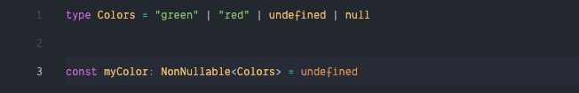
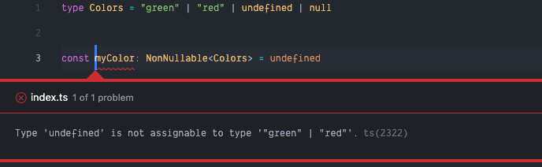

Typescript has been my go-to language every time I start a new project. Typescript helps us to describe objects and to make inline documentation better. One of the things I love about typescript is it already provide utility function to facilitate common type transformations. This time we are going to talk about some of these utility types that I often use everyday.

### 1. Partial and Required

`Partial<T>` is the utility type that I use the most. This type makes all the properties of an interface optional.

```tsx
type Cars = {
    brand: string
    color: string
}

const helloCars = ( cars: Partial<Cars> ) => {
    if(cars.color) {
        console.log(`That is a ${cars.color} ${cars.brand}`)
    } else {
        console.log(`That is a ${cars.brand}`)
    }
}

helloCars({ brand: "Honda", color: "yellow"}) // That is a yellow Honda
helloCars({ brand: "Mercedes" }) // That is a  Mercedes
```

In the example above, we can see that we can call the `helloCars` function without defining the "colors" property because when we use `Partial<Cars>`, the object will change its annotation as you can see below.

```ts
// Partial<Cars> 
{
	brand?: string,
	color? string
}
```

In contrast to `Partial<T>`, `Required<T>` actually makes all fields of `T` required

```ts 
// Required<Cars> 
{
	brand: string,
	color string
}
```

<br/>

### 2. Readonly

As the name suggests, `Readonly<T>` makes all fields in the interface read-only. This means that they become immutable and cannot be reassigned.  

```tsx
interface Cars {
    brand: string
    color: string
}

const myCars: Readonly<Cars> = {
    brand: "BMW",
    color: "white"
}

// Cannot assign to 'brand' because it is a read-only property.
myCars.brand = "Datsun"
// Cannot assign to 'color' because it is a read-only property.
myCars.color = "yellow"
```

<br/>

### 3. Record type

With `Record<K,T>` we can construct an object type using a union `K` as our keys and `T` as the value. Let's use the fields from the previous example.

```tsx
type keys = "brand" | "color"

type Cars = Record<keys, string>

const helloCars = ( cars: Cars ) => {
    console.log(`You have a nice ${cars.color} ${cars.brand}`)
}

helloCars({ brand: "BMW", color: "black" }) // You have a nice black BMW
```

With that union `keys`, you can add as many keys as you like. This will become a problem when you have a big object and wants to restrict the keys depends on an object. Luckily, we can solve this problem by using the `keyof`

```ts
interface Cars = {
    brand: string
    color: string
}

const restrictedCars: Record<keyof Cars, string> = {
    brand: "Mercedes",
    color: "red",
    unexpectedKey: "value" // will not allowed since we only allowed 'brand' and 'color'
}
```

<br/>

### 4. Pick and Omit

There will be a time when you just want to pick some keys from an interface and construct a new one. This is when `Pick<I, K>` comes into play. `Pick<I, K>` is a utility type that constructs an interface by picking `K` fields that are listed in `I`.

```ts
interface Cars = {
    brand: string
    color: string
    year: number
}

interface PickCars = Pick<Cars, "color" | "year">

const restrictedCars: PickCars = {
    brand: "Mercedes",  // will error since we just pick 'color' and 'year' from Cars
    color: "red",
    year: 2020
}
```

And there is `Omit<I, K>` that does the exact opposite of `Pick<I,K`, `Omit<I,K>` constructs an interface by picking all fields in `I` and then remove `K` keys.

```ts
interface Cars = {
    brand: string
    color: string
    year: number
}

interface OmitCars = Omit<Cars, "brand">

const restrictedCars: OmitCars = {
    brand: "Mercedes",  // will error since we omit 'brand' from Cars
    color: "red",
    year: 2020
}
```

The 2 examples above will return the same interface since they contain "color" and "year" in our constructed type.

<br/>

### 5. Extract and Exclude

What if we want to Pick and Omit but on union type? Luckily, typescript provides a similar behavior with Extract and Exclude.

`Extract<T, U>` constructs a type by picking types from `T` that are a subset of `U`. However, `Exclude<T, U>` do the opposite by excluding types from `T` that are a subset of `U`. Let's see a few examples.

```ts
type AllDrinks = "teh" | "kopi" | "susu" | "jus" | 99 | (() => string)
type DrinksWeLike = "teh" | "susu" | "bandrek"

type DrinksExtracted = Extract<AllDrinks, string> // "teh" | "kopi" | "susu" | "jus"
type AvailableDrinks = Extract<DrinksExtracted, DrinkWeLike> // "teh" | "susu"

type DrinksExcluded = Exclude<AllDrinks, number | Function > // "teh" | "kopi" | "susu" | "jus"
type DrinksWeHate = Exclude<DrinksExcluded, DrinkWeLike> // "kopi" | "jus"
```

<br/>

### 6. NonNullable

`NonNullable<T>` is a utility type that we can use to avoid `null` or `undefined`. 

```tsx
type Colors = "green" | "red" | undefined | null

type CorrectColors = NonNullable<Colors> // "green" | "red"
```

But the interesting part is, this type is only worked if you use `—strictNullChecks` flag or set `strictNullChecks: true` on your tsconfig.

For example, this code is using `strictNullChecks: false` , as you can see the variable can still be assigned to `undefined`



and this is using `strictNullChecks: true`, the TS compiler will tell you immediately about the error.




### 7. ReturnType

`ReturnType<F>` returns the return type definition of `F`. To avoid an error, remember to always fill the `F` with function. Here is some example.

```tsx
type stringF = ReturnType<() => string> // string
type numberF = ReturnType<() => number> // number
type unknownF = ReturnType<<T>() => T> // unknown
type wrongType1 = ReturnType<number> // Error: Type 'number' does not satisfy the constraint '(...args: any) => any'.
type wrongType2 = ReturnType<Function> // Error: Type 'Function' does not satisfy the constraint '(...args: any) => any'.
```

Moreover, you also can get a return type of an existing function by utilizing `typeof`

```tsx
function helloCars() {
    return {
        brand: "Honda",
        color: "yellow"
    }
}

type F = ReturnType<typeof helloCars>
// type F = {
//     brand: string;
//     color: string;
// }
```

<br/>

### Conclusion

There are many other utility types you can use to help you construct your type but I hope these 7 utilities will help you to start understanding how to use them on your code. Please reach me on [twitter](https://twitter.com/santosidauruk) on [linkedIn](https://www.linkedin.com/in/santo-sidauruk/) if you have any questions or feedback. Hope we'll meet on another article, until then, stay great!